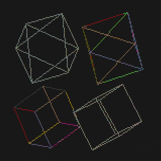
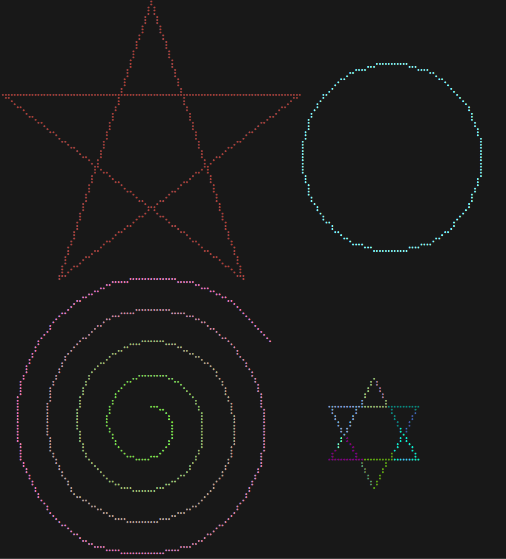

# Rsille 🎨

The rsille is a Rust library for drawing graphics in the terminal. It leverages Braille code to provide an 8x resolution equivalent to ASCII art, enabling you to create beautiful graphics right in your terminal. This library offers an API and functionality similar to the turtle module in Python, while also supporting rendering of 3D objects.



## Features

- High-resolution drawing using Braille code.
- Provides an intuitive API similar to the turtle module in Python.
- Supports basic 2D graphics drawing and 3D object rendering.
- Lightweight and easy to integrate into your Rust projects.

## Installation

To use the Terminal Graphics Library in your Rust project, simply add the following dependency to your `Cargo.toml` file:

```toml
[dependencies]
rsille = "1.0.0"
```

## Usage

Here's a simple example demonstrating how to use the rsille to draw a star:

```rust
fn main() {
    let mut canvas = Canvas::new();
    let mut t = Turtle::new();
    for _ in 0..5 {
        t.forward(100.0);
        t.right(144.0);
    }
    canvas.paint(&t, 0.0, 30.0).unwrap();
    println!("{}", canvas.frame());
}
```

## Examples

You can find more example code and in the `examples` directory, showcasing various features and use cases of the Terminal Graphics Library.

and some example pictures:



## License

This project is licensed under the MIT License. See the LICENSE file for more information.
