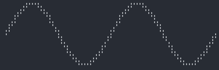
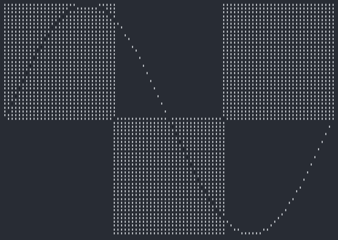
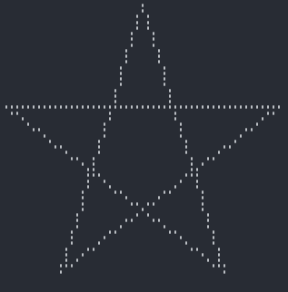
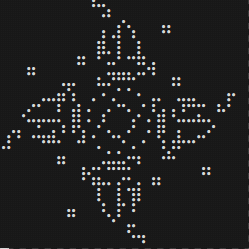
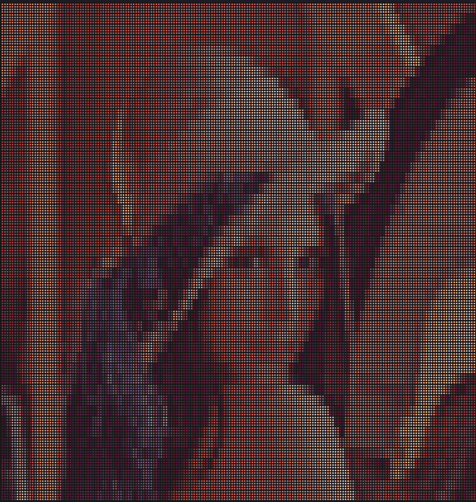
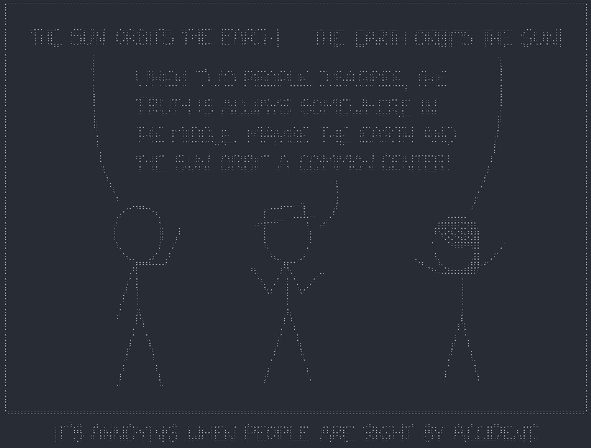

**IMPORTANT: now dev on [v3](https://github.com/nidhoggfgg/rsille/tree/v3)**

<div align="center">

# Rsille 🎨

[](./LICENCE)
[](https://crates.io/crates/rsille/versions)
[](https://crates.io/crates/rsille)
[](https://docs.rs/rsille/latest/rsille/)


[English](./README.md) • [中文](./README_cn.md)

<div align="center">
  
  
  
  
  
  
</div>

</div>

## 📚 ToC

------

* [👀 Try it](#👀-try-it)
* [🔧 Installation](#🔧-installation)
* [🚀 Usage](#🚀-usage)
  * [Basics](#basics)
  * [Turtle](#turtle)
  * [3D Object](#3d-object)
  * [Life game](#conways-game-of-life)
  * [Images](#images)
  * [Animation](#animation)
* [📌 TODO](#📌-todo)
* [📝 License](#📝-license)

## 👀 Try it

All images used in the readme can be found in the [`examples`](./examples/) folder, ready to run without programming!
```
git clone https://github.com/nidhoggfgg/rsille.git
cd rsille
cargo run --example cube
```

This will generate a rotating cube.

For more examples or to try generating those interesting patterns yourself, you can use `cargo run --example`, and you'll find all the executable examples without programming.

Sure, there is more examples, like [bad-apple](./imgs/bad-apple.gif) and so on.
You can check the usage to know how to use this lib.

## 🔧 Installation

This is a Rust library, so all you need to do is add the following code to your Cargo.toml to use it:
```toml
[dependencies]
rsille = "2.1.0"
```

## 🚀 Usage

Due to space limitations, only some commonly used APIs and general usage methods are provided here.

For detailed APIs, please visit [doc.rs](https://docs.rs/rsille/latest/rsille/).

### Basics

The most basic function is `set`.
```rust
use rsille::Canvas;
fn main() {
    let mut c = Canvas::new();
    for x in -360..360 {
        let x = x as f64;
        c.set(x / 10.0, x.to_radians().sin() * 10.0);
    }
    c.print();
}
```


Why is it *(x / 10.0, x.to_radians().sin() * 10.0)* instead of *(x, x.sin())*?
You can try adding, subtracting, multiplying, and dividing to change the coordinates being drawn. A small hint: `⠿` contains 8 points.
If you really don't understand or want to know why, you can directly use the *(x, y)* in your algorithems. I might write an article about braille code later.

------

The opposite of `set` is `unset`, which erases points that have been set.

------

Another useful method is `toggle`, which `unset` points that have been `set` and `set` points that have not been `set`.
```rust
use rsille::Canvas;
fn main() {
    let mut c = Canvas::new();
    for x in (0..360).step_by(4) {
        let x = x as f64;
        c.set(x / 4.0, x.to_radians().sin() * 30.0);
    }

    for x in 0..=30 {
        for y in 0..=30 {
            c.toggle(x, y);
            c.toggle(x + 30, y - 30);
            c.toggle(x + 60, y);
        }
    }
    c.print();
}
```


This is example is a littler longer, let's explain it:
* `(0..360).step_by(4)` iterates over *x* in the interval *[0, π)*, and `step_by(4)` is used for downsampling to make the lines finer (too low a value could result in imprecision).
* The first `for` loop is for drawing the graph of *f(x) = sin(x)*. To make it look better, there is a certain scaling applied to both *x* and *y*.
* The second `for` loop is for creating those `toggle` blocks, each of which is 31x31 in size.

In `toggle`, `f64` are not used because all methods support generics and can accept various numeric types!
However, it is still strongly recommended to use `f64` for higher precision.

### Turtle

In Python, there is an interesting library called turtle.
It allows beginners who are just starting to use Python to experience the joy of programming.
This library also implements most of the methods in turtle.
```rust
use rsille::{extra::Turtle, Canvas};
fn main() {
    let mut canvas = Canvas::new();
    let mut t = Turtle::new();
    for _ in 0..5 {
        t.forward(50);
        t.right(144);
    }
    canvas.paint(&t, 0, 0).unwrap();
    canvas.print();
}
```


The two *0* in the `paint` method are not fixed; they place the object to be drawn at *(0, 0)*.
This is arbitrary, but it's a good idea to always draw a single object at *(0, 0)*.

No more introduction to turtle; you can directly copy Python code and modify it slightly to use.

### 3D Object

This library also supports 3D objects and provides convenient methods for constructing objects easily.
```rust
use rsille::{extra::Object3D, Animation};

fn main() {
    let mut anime = Animation::new();
    let cube = Object3D::cube(30);
    anime.push(
        cube,
        |cube| {
            cube.rotate((1.0, 2.0, 3.0));
            false
        },
        (0, 0),
    );
    anime.run();
}
```


Here, `Animation` is used to create animations, which are also internally supported. You can check [Animation](#animation) to see more details.

`Object3D` mainly has two useful methods: `rotate` for rotating objects and `zoom` for scaling objects.

### Conway's Game of Life

Conway's Game of Life is very interesting, so it is also part of the library.
```rust
use rsille::{extra::LifeGame, Animation};

fn main() {
    let mut anime = Animation::new();
    let lg = LifeGame::from(r#"x = 47, y = 47, rule = B3/S23
18bo$18b3o$21bo$20b2o$$32b2o$32b2o$26bobo$28bo$$22b3o$15b2o5bo2bo$15b2o
2o5bo3bo$5b2o19bo$5b2o15bo3bo$22bo2bo8b2o$22b3o9b2o$$7b2o36b2o$45bo$7b
o4b3o28bobo$11bo3bo27b2o$10bo5bo13b3ob3o$10bo5bo13bo5bo$10b3ob3o13bo5b
o$2b2o27bo3bo$bobo28b3o4bo$bo$2o36b2o$$11b2o9b3o$11b2o8bo2bo$20bo3bo
15b2o$20bo19b2o$20bo3bo5b2o$21bo2bo5b2o$22b3o$$18bo$18bobo$13b2o$13b2o
$$25b2o$25bo$26b3o$28bo!"#).unwrap();
    anime.push(
        lg,
        |lg| lg.update(),
        (0, 0),
    );
    anime.run();
}
```


Here, `Animation` is still used, and the `rle` file for Conway's Game of Life is parsed.
Everything needed to parse the `rle` file is already written inside `Lifegame`, with no additional dependencies, and the parsing code is very lightweight.

### Images

Using braille code to draw images is also a good choice.
However, the image library used for parsing `images` is a bit large, so it is not enabled by default.
To use it, please add the following to your Cargo.toml:
```toml
[dependencies]
rsille = { version = "2.1.0", features = ["img"] }
```

Here's an example of usage. Note: Please fill in the image file path!
```rust
use rsille::{extra::Imgille, Canvas};

fn main() {
    let mut canvas = Canvas::new();
    let img = Imgille::new("path/to/img").unwrap();
    canvas.paint(&img, 0, 0).unwrap();
    canvas.print();
}
```




By default, it uses color, which is not very friendly to grayscale images or black and white images (like those from xkcd), and it can reduce clarity!

So for them, you must definitely call `color(false)`!

It also supports inversion, such as the two xkcd images above, the one with black as the main color is not inverted, and the one with white as the main color is inverted. Call `invert(true)` to invert the colors.
For color images, not using color is also a good choice, for example:


Additionally, the size of the image will automatically scale with the terminal, whether it's a long or wide terminal, it will always scale correctly!

### Animation

Generating some objects, then drawing them onto the `Canvas`, then updating the objects, and redrawing.
You also need to set the frame rate, handle user input, etc.
Writing your own code to create an animation using the basic `Canvas` is always so troublesome!
Not to mention the appropriate erasing of the screen and preventing flickering, etc.

So this library wraps up all these troublesome things. It only takes 3 lines of code to create an animation with it!

1. Create a new animation `let mut anime = Animation::new()`
2. Load a drawable object and an update function `anime.push()`
3. Run `anime.run()`

It's incredibly simple!
```rust
use rsille::{extra::Object3D , Animation};

fn main() {
    let cube = Object3D::cube(30);
    let mut anime = Animation::new();
    anime.push(cube, |cube| { cube.rotate((1.0, 2.0, 3.0)); false }, (0, 0));
    anime.run();
}
```

The parameters for the `push` method are as follows:
1. The object, just pass it directly.
2. A closure that returns a boolean as the update function. This closure will run once per frame. When the closure returns true, the object stops updating and will no longer execute the update function, but it will still be drawn on the canvas. When all objects have finished updating, the animation stops.
3. *(x, y)*, the position where the object is placed, generally only used when there are multiple objects.

For user input handling, currently, only ctrl+c and esc are available to exit.
In the future, custom handling will likely be supported.

## 📌 TODO

- [ ] Optimize multithreading in `Animation`.
- [ ] Add more features to `Animation`.
- [ ] Add more drawable objects.
- [ ] Add a bounded version for `Lifegame`.
- [ ] More examples.

## 📝 License

[MIT](./LICENCE)