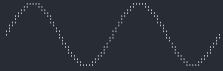
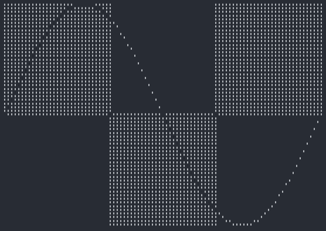
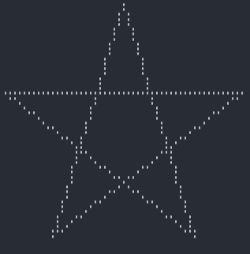
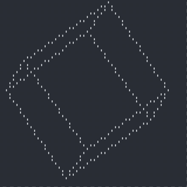
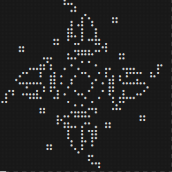
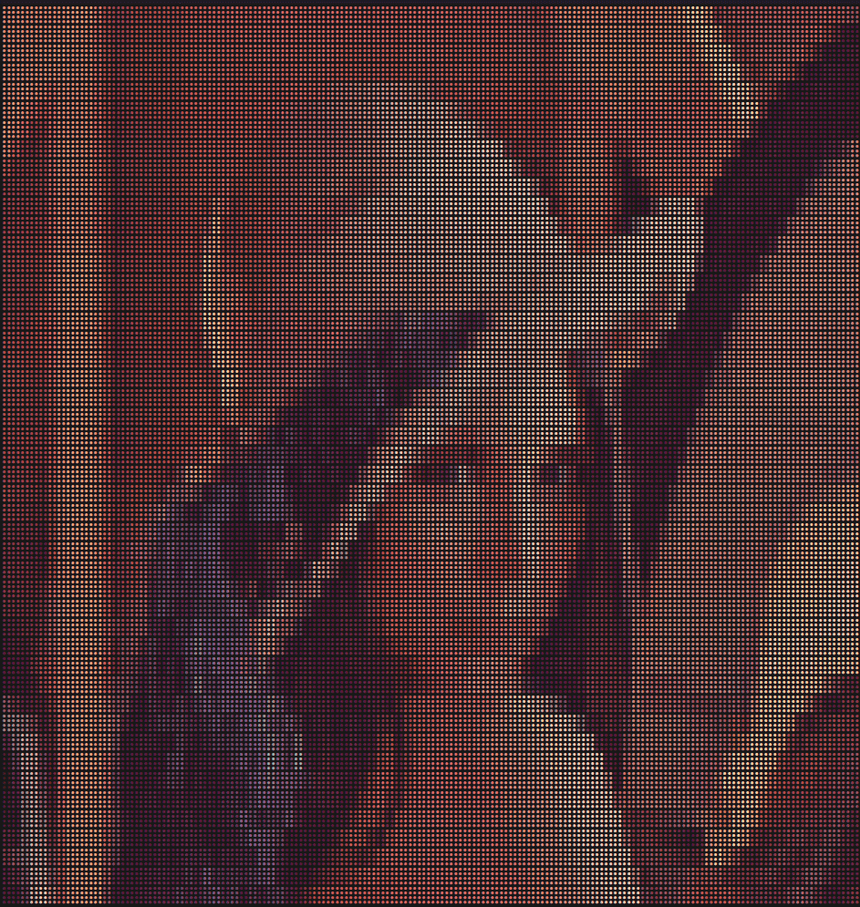
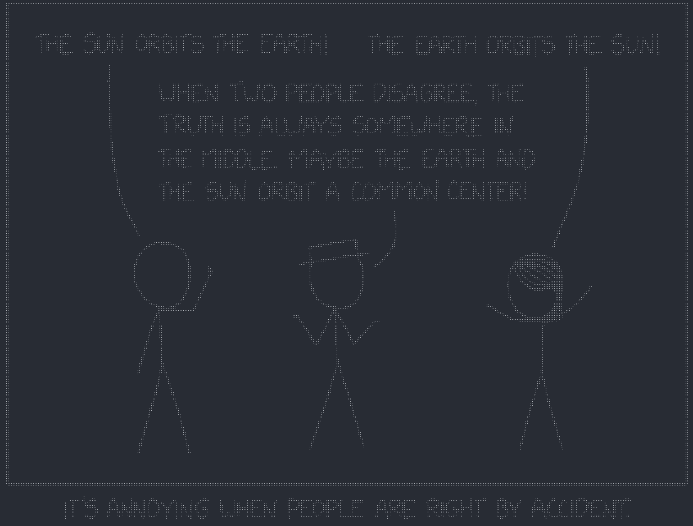
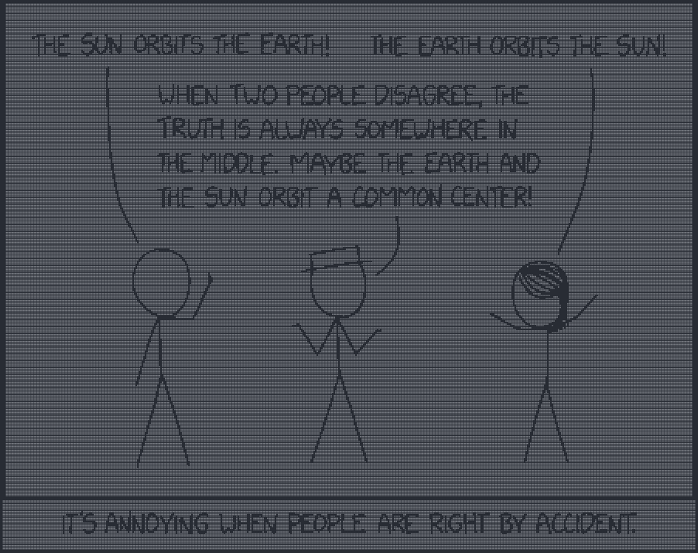
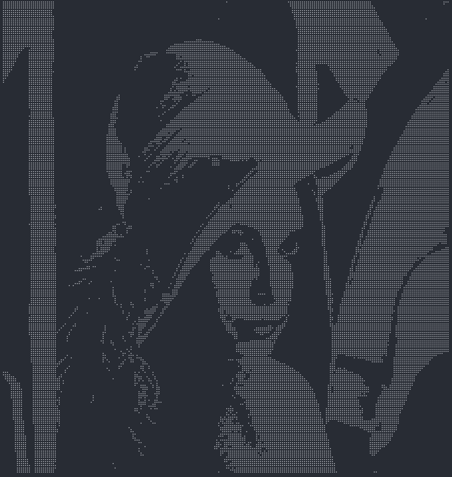

<div align="center">

# Rsille 🎨

[](./LICENCE)
[](https://crates.io/crates/rsille/versions)
[](https://crates.io/crates/rsille)
[](https://docs.rs/rsille/latest/rsille/)

[English](./README.md) • [中文](./README_cn.md)

</div>


## 📚 目录

-------

* [尝试一下](#尝试一下)
* [安装](#安装)
* [使用方法](#使用方法)
    * [基础](#基础)
    * [Turtle](#turtle)
    * [3D object](#3d-object)
    * [生命游戏](#生命游戏)
    * [图片](#图片)
    * [动画](#动画)
* [TODO](#todo)
* [许可](#📝-许可)


## 👀 尝试一下

所有 readme 中使用的图片都可以在[`example`](./examples/)，中找到无需编程直接运行！
```
git clone https://github.com/nidhoggfgg/rsille.git
cd rsille
cargo run --example cube
```
这会产生一个旋转的正方体。
关于更多例子或者想自己尝试生成那些有趣的图案，可以尝试使用 `cargo run --example`，你会找到所有的可执行的例子而无需编程。

## 🔧 安装

这是一个 rust 库，所以你只需要将如下代码添加到你的 Cargo.toml 中即可使用

```toml
[dependencies]
rsille = "2.1.0"
```

## 🚀使用方法

限于篇幅，此处给出的是比较常用的 api 以及一般的使用方法。
关于详细的 api，可以去往 [doc.rs](https://docs.rs/rsille/latest/rsille/) 查看

### 基础

最基础的就是 `set`
```rust
use rsille::Canvas;
fn main() {
    let mut c = Canvas::new();
    for x in -360..360 {
        let x = x as f64;
        c.set(x / 10.0, x.to_radians().sin() * 10.0);
    }
    c.print();
}
```


关于为什么是 *(x / 10.0, x.to_radians().sin() * 10.0)* 而不是 *(x, x.sin())*。
这一点你可以自己尝试加减乘除来更改绘制的坐标，有一个小提示 `⠿` 包含 8 个点。
如果你真的不理解或者想知道为什么，可以查看 [内部解析](#内部解析)。
稍后我可能会写一遍文章关于 braille code。

------

与 `set` 相反的是 `unset`，作用就是将 `set` 过的点擦，这里就不给出具体的例子了。

------

还有一个有用的方法就是 `toggle`，它会将已经 `set` 过的点 `unset`，而 `set` 未 `set` 的点
```rust
use rsille::Canvas;
fn main() {
    let mut c = Canvas::new();
    for x in (0..360).step_by(4) {
        let x = x as f64;
        c.set(x / 4.0, x.to_radians().sin() * 30.0);
    }

    for x in 0..=30 {
        for y in 0..=30 {
            c.toggle(x, y);
            c.toggle(x + 30, y - 30);
            c.toggle(x + 60, y);
        }
    }
    c.print();
}
```


这个例子稍微有点长，先来解释一下其中的代码。
* `(0..360).step_by(4)` 是在 *[0, π)* 上遍历 *x*，而 `step_by(4)` 是为了降采样，使线条更细（太低会导致不精确）
* 第一个 `for` 就是为了画出 *f(x) = sin(x)* 的图像，为了更好看，这里对 *x* 和 *y* 有一定的缩放
* 第二个 `for` 中就是为了产生那几个 `toggle` 块，它们的大小都是 31x31

在 `toggle` 中并没有使用浮点数，这是因为所有的方法都是有泛型支持的，可以传入各种数值！
不过仍然强烈建议使用 `f64` 来实现更高的精度。

### Turtle

在 python 中，有个很有趣的库就是 turtle。
它可以使初次使用 python 的初学者也能体会编程的乐趣。
在这个库中也实现了 turtle 中大部分的方法。
```rust
use rsille::{extra::Turtle, Canvas};
fn main() {
    let mut canvas = Canvas::new();
    let mut t = Turtle::new();
    for _ in 0..5 {
        t.forward(50);
        t.right(144);
    }
    canvas.paint(&t, 0, 0).unwrap();
    canvas.print();
}
```


`paint` 方法中的两个 *0* 并不是固定的，而是将目标绘制在 *(0, 0)*。
这是任意的，但是对于单个物体，总是绘制在 `(0, 0)` 是不错的。

turtle 就不过多介绍了，可以直接粘贴 python 的代码稍加修改即可使用。

### 3D Object

这个库也对三维物体提供了支持，还有内部方便的直接构造物体的方法
```rust
use rsille::{extra::Object3D, Animation};

fn main() {
    let mut anime = Animation::new();
    let cube = Object3D::cube(30);
    anime.push(
        cube,
        |cube| {
            cube.rotate((1.0, 2.0, 3.0));
            false
        },
        (0, 0),
    );
    anime.run();
}
```


这里使用了 `Animation` 来产生动画，这也是内部支持的，可以点开 [动画](#动画) 查看详细信息

`Object3D` 主要有两个有用的方法，一个是 `rotate` 用于旋转物体，另一个则是 `zoom` 用于缩放物体。

### 生命游戏

生命游戏非常有意思，所以也作为了库的一部分
```rust
use rsille::{extra::LifeGame, Animation};

fn main() {
    let mut anime = Animation::new();
    let lg = LifeGame::from(r#"
x = 47, y = 47, rule = B3/S23
18bo$18b3o$21bo$20b2o$$32b2o$32b2o$26bobo$28bo$$22b3o$15b2o5bo2bo$15b
2o5bo3bo$5b2o19bo$5b2o15bo3bo$22bo2bo8b2o$22b3o9b2o$$7b2o36b2o$45bo$7b
o4b3o28bobo$11bo3bo27b2o$10bo5bo13b3ob3o$10bo5bo13bo5bo$10b3ob3o13bo5b
o$2b2o27bo3bo$bobo28b3o4bo$bo$2o36b2o$$11b2o9b3o$11b2o8bo2bo$20bo3bo
15b2o$20bo19b2o$20bo3bo5b2o$21bo2bo5b2o$22b3o$$18bo$18bobo$13b2o$13b2o
$$25b2o$25bo$26b3o$28bo!
"#).unwrap();
    anime.push(
        lg,
        |lg| lg.update(),
        (0, 0),
    );
    anime.run();
}
```


这里仍然是使用 `Animation`，同时解析 lifegame 的 `rle` 文件。
在 `Lifegame` 内部已经编写了解析 `rle` 文件所需的一切，没有添加任何依赖，而且解析的代码是非常轻量化的。

### 图片

使用 braille code 来绘制图片也是非常不错的选择。
但是由于解析图片使用的 `image` 库有点大，默认是不启用的。
想要使用则请将 Cargo.toml 添加如下内容
```toml
[dependencies]
rsille = { version = "2.1.0", features = ["img"] }
```

这是一个使用的案例。注意：请填上图片的文件路径！
```rust
use rsille::{extra::Imgille, Canvas};

fn main() {
    let mut canvas = Canvas::new();
    let img = Imgille::new("path/to/img").unwrap();
    canvas.paint(&img, 0, 0).unwrap();
    canvas.print();
}
```




默认是使用颜色，而使用颜色的情况下对灰度图或者黑白图(比如来自 xkcd)等非常不友好，还会降低清晰度！

所以对于它们可以一定要调用 `color(false)` ！
同时还支持反色，比如上方两张 xckd 的图片，黑色为主的是未反色的，白色为主的是反色的，调用 `invert(true)` 即可反色。
而对于彩色图片，不使用颜色一样是不错的选择，比如：



另外，图片的大小会随着终端自动缩放，无论是长的终端还是宽的终端，它总是能正确地缩放至合适大小！

### 动画

生成一些物体，然后绘制到 `Canvas`上，接着更新物体，重新绘制。
还要设置帧数，处理用户输入等。
每次自己写代码利用基础的 `Canvas` 绘制一个动画都是如此麻烦！
更别提还有合适地擦除屏幕以及防止闪烁等问题。

所以这个库将这些麻烦事都包装了起来，使用它来产生动画只需要 3 行代码即可！

1. 新建一个动画 `let mut anime = Animation::new()`
2. 装载一个可以绘制的目标以及更新函数 `anime.push()`
3. 运行 `anime.run()`

简直简单到了极点！
```rust
use rsille::{extra::Object3D, Animation};

fn main() {
    let cube = Object3D::cube(30);
    let mut anime = Animation::new();
    anime.push(cube, |cube| { cube.rotate((1.0, 2.0, 3.0)); false }, (0, 0));
    anime.run();
}
```

`push` 方法的参数如下:
1. 目标，直接传入即可
2. 闭包，一个返回值为 `bool` 的更新函数。每一帧都会运行一次该闭包，当闭包返回值为 `true` 时该目标停止更新，也不会再执行更新函数，但仍然会绘制在画布上。当所有的目标都已经结束更新，动画停止。
3. *(x, y)*，放置目标所在的位置，一般只有多个目标时使用

对于用户输入的处理，目前只有 `ctrl+c` 和 `esc` 退出，
之后应该会开放自定义。

## 📌 TODO

- [ ] 优化 `Animation` 中多线程
- [ ] 为 `Animation` 添加更多功能
- [ ] 添加更多可绘制的对象
- [ ] 为 `Lifegame` 添加有边界的版本
- [ ] 更多的例子

## 📝 许可

[MIT](./LICENCE)
