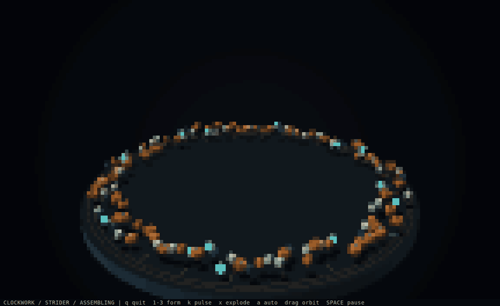

# rsille

[English](README.md) · 中文


**让终端，惊艳起来。**

**rsille 是 Rust 终端应用与图形框架**：
把组件布局、彩色图形、动画特效和键鼠交互放进同一套 API。
用 Unicode Canvas 绘制字符图形，用 Sixel 输出像素图像；
画布、编辑器、表格和浮窗可以组合成同一个应用，
从轻量 inline 工具到全屏交互工作台，
不必分别搭建渲染与事件循环。

## 一个终端，可以有多少种模样？

| 像素级绘图 · Sixel | 桌面式布局 · TUI |
| --- | --- |
| [](packages/rsille-playground/function-plotter/README_cn.md) | [](examples/lumen/README_cn.md) |
| **图形不再受字符形状限制。** RGB 像素画布通过 Sixel 输出，支持布局、裁剪、滚动与不透明遮挡；在兼容终端中，将精细曲线、图像和自定义可视化嵌入界面。 | **终端界面不必只有固定面板。** Flex/Grid 布局组合编辑器、表格和画布；浮窗支持拖动、调整大小、收起和恢复，配合焦点管理与命令面板，构建多区域工作台。 |

| 连续动画 · Unicode Canvas | 图形与组件 · 同一套交互 |
| --- | --- |
| [](examples/clockwork/README_cn.md) | [](examples/pokemon-battle/README_cn.md) |
| **字符格也能承载动态场景。** 盲文、半块和四分块编码支持彩色采样图形，配合逐帧更新与输入处理，可呈现程序化动画和自行投影的三维场景，而不只是静态图表。 | **画布不是界面里的孤岛。** 图形与按钮、状态条共用布局和事件系统；世界坐标与指针转换保持一致，再组合渐变、扫光、毛玻璃与过渡，让可视化既能看，也能操作。 |

Function Plotter 为离线 RGB 预览，非终端录屏，
不包含 Sixel 量化与刷新行为；
其余预览由渲染后的终端字符格导出，Clockwork 的 GIF 做了加速。
场景和模拟逻辑由示例提供，rsille 负责画布、编码、组件、渲染与事件循环。

## 效果惊艳，写起来也顺手


- **声明界面，不手写事件循环。** `view` 描述组件，`update` 处理消息与状态；
  运行时统一处理焦点、输入、后台任务和退出清理。
- **组合特效，不重写组件。** `visual(...)` 为字符组件叠加渐变、扫光、溶解和波浪，
  保留原有交互；内置视觉动画由运行时驱动，无需手写逐帧循环。
- **按应用选择呈现方式。** 全屏构建完整工作台，inline 留在普通终端屏幕；
  不需要组件树时，也能直接使用 Canvas 和渲染器。
- **交互和异步逻辑也能自动化测试。** 无需真实终端即可回放输入、检查渲染帧，
  用手动时钟和执行器控制计时器与后台任务。
- **直接在你的 shell 上作画。** [rsille-overlay](packages/rsille-overlay/README.md)
  在 PTY 中运行 shell，把组件或图像浮在上面，并随你执行的命令做出反应。`rsille pet` 就基于它。

**更多示例**：
[方块沙盒](examples/minecraft/README_cn.md)、
[拖放文件管理器](examples/orbit-files/README_cn.md)、
[七页组件展厅](examples/tui-showcase/README_cn.md)。

## 配合 AI 编程助手开发

[rsille skill](https://github.com/nidhoggfgg/rsille.skills/blob/main/rsille/SKILL.md)
帮助编程助手使用 v3 API 开发终端应用，
涵盖组件与布局、后台任务、输入处理、Canvas 图形、动画和无终端测试，
并提供
[组件索引](https://github.com/nidhoggfgg/rsille.skills/blob/main/rsille/references/components.md)
及可独立运行的应用模板，
可通过 [Skills CLI](https://github.com/vercel-labs/skills) 安装：

```bash
npx skills add nidhoggfgg/rsille.skills --skill rsille
```

## 体验终端游乐场

从 [Playground 发布列表](https://github.com/nidhoggfgg/rsille/releases?q=rsille-playground-v) 下载对应系统的可执行文件（从 0.1.2 之后的版本开始提供）。Linux 或 macOS 用户将文件改名为 `rsille`，执行 `chmod +x rsille` 后运行 `./rsille --help`。Windows 用户在 PowerShell 运行 `.\rsille.exe --help`。也可以在仓库根目录运行 `cargo run -p rsille-playground`。详见 [Playground 安装与使用指南](packages/rsille-playground/README.md)。

## 在应用中引入 rsille

```toml
[dependencies]
rsille = "3.4.0"
```

默认启用 `raster`，提供 `RasterCanvas`、`raster_canvas` 组件以及 Kitty 和 Sixel 输出。
只使用文本和字符画布时，可设置 `default-features = false`。

需要代码高亮时，添加独立扩展 [`rsille-syntect`](packages/rsille-syntect/README.md)，
再将 `rsille_syntect::highlight(source, "rs")` 的结果传给 `CodeViewer::from_lines`。

## 第一个应用，就带动画

```rust,no_run
use std::time::Duration;
use rsille::tui::prelude::*;

fn main() -> WidgetResult<()> {
    let exit = App::new(0_u32)
        .mode(Mode::Inline)
        .update(|count, (), _ctx| *count += 1)
        .view(|count| {
            visual(
                button(format!("计数：{count}"))
                    .variant(ButtonVariant::Ghost)
                    .on_click(|| ()),
            )
                .gradient(
                    Color::Rgb(70, 220, 255),
                    Color::Rgb(240, 110, 255),
                    GradientDirection::Horizontal,
                )
                .highlight_sweep()
                .animation(looping_visual_spec(Duration::from_secs(2)))
        })
        .run()?;

    println!("最终计数：{}", exit.state);
    Ok(())
}
```


## 绘图：Unicode Canvas 与 Sixel

**一个字符格，也能画出更多细节。**
`Encoding::Quadrant` 将每个终端字符格细分为 **2 × 2 个采样位置**，
通过四分块字符与前景、背景颜色组合，
在有限的行列里表现更细的轮廓。
120 × 20 个字符格，对应 240 × 40 的采样网格。

[](packages/rsille-playground/ai-babies/README_cn.md)

上图是 [AI Babies 静态模式](packages/rsille-playground/ai-babies/README_cn.md) 的实际 Canvas 输出，
仅占 **20 行**；预览按字符格比例放大，便于查看细节。

| 编码 | 每个字符格的采样数 | 用途 |
| --- | --- | --- |
| `Encoding::Braille`（默认） | 2 × 4 | 密集线条、曲线和彩色场景 |
| `Encoding::HalfBlock` | 1 × 2 | 上下两个可独立着色的采样点 |
| `Encoding::Quadrant` | 2 × 2 | 四分块形状，采样颜色拟合为终端颜色 |

**支持 Sixel，让终端图形不再受字符形状限制。**
在支持 Sixel 的终端中呈现精细曲线、彩色图像与丰富的可视化，
并与文本、按钮和其他组件融为一体。

全屏应用可以在 `.update(...)` 前设置 `.raster_backend(RasterBackend::Auto)`。
启动时优先选 Kitty，其次选 Sixel。
显式指定 `Kitty` 或 `Sixel` 会在启动时报告错误。Auto 允许先绘制文本，在首次需要图像时才报告协商失败。
Kitty 保留原始 RGB 和透明像素，拖动时可以复用已上传的图像。启动探测支持 macOS、Linux、WSL 和原生 Windows 控制台。
使用自定义 writer 时可以通过 `.raster_session(...)` 传入已验证的全屏协议与字符像素尺寸。
全屏 Sixel 要求 ED 2 能擦除图像、调色板稳定、补齐像素透明且定位输出不会滚屏。
inline Sixel 沿用 `.raster_output(...)`，由宿主确认整行擦除和图像随文字滚动。
inline 应用也可在读取输入前调用 `RasterBackend::Auto.negotiate_inline(...)`，将结果传给 `.inline_raster_session(...)`。inline 的 Auto 优先选择 Kitty，终端仅声明支持 Sixel 时自动使用 Sixel。探测检查协议支持，逐行擦除图像、图像随文字滚动和定位输出效果取决于终端。

## 扩展：Typst 数学公式

独立扩展 [`rsille-typst`](packages/rsille-typst/README.md)
将 Typst 数学语法渲染为 `RasterCanvas`，在兼容的 Sixel 终端中展示公式，
不向核心 crate 添加 Typst 依赖。


## API 与资料入口

`rsille` 统一导出 `rsille-tui`、`rsille-render` 和 `rsille-canvas`。也可以根据需要单独依赖其中一个包。

| 公开模块 | 职责 | 源码 |
| --- | --- | --- |
| `rsille::tui` | 应用、组件、布局、输入和特效 | [rsille-tui](packages/rsille-tui) |
| `rsille::render` | Buffer、带样式的 Unicode 文本、绘制与终端循环 | [rsille-render](packages/rsille-render) |
| `rsille::canvas` | 采样图形与终端编码 | [rsille-canvas](packages/rsille-canvas) |
| `rsille::raster` | RGB 栅格画布、Sixel 输出与能力配置 | [rsille-render/src/raster](packages/rsille-render/src/raster) |

- [示例目录](examples/README_cn.md)
- [TUI 小示例](packages/rsille-tui/examples/README_cn.md)
- [Canvas 调试与图像后端对照](examples/canvas/README_cn.md)
- [MIT 许可](LICENCE)
